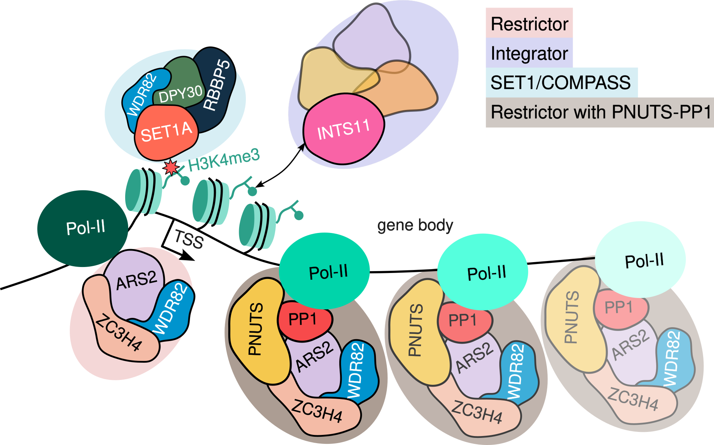

## Modeling transcription with explainable AI uncovers context-specific epigenetic gene regulation at promoters and gene bodies

Transcriptional regulation involves complex interactions with chromatin-associated proteins, but disentangling these mechanistically remains challenging. Here, we generate deep learning models to predict RNA Pol-II occupancy from chromatin-associated protein profiles in unperturbed conditions. We evaluate the suitability of Shapley Additive Explanations (SHAP), a widely used explainable AI (XAI) approach, to infer functional relevance and analyse regulatory mechanisms across diverse datasets. We aim to validate these insights using data from degron-based perturbation experiments. Remarkably, genes ranked by SHAP importance predict direct targets of perturbation even from unperturbed data, enabling inference without costly experimental interventions. Our analysis reveals that SHAP not only predicts differential gene expression but also captures the magnitude of transcriptional changes. We validate the cooperative roles of SET1A and ZC3H4 at promoters and uncover novel regulatory contributions of ZC3H4 at gene bodies in influencing transcription. Cross-dataset validation uncovers unexpected connections between ZC3H4, a component of the Restrictor complex, and INTS11, part of the Integrator complex, suggesting crosstalk mediated by H3K4me3 and the SET1/COMPASS complex in transcriptional regulation. These findings highlight the power of integrating predictive modelling and experimental validation to unravel complex context-dependent regulatory networks and generate novel biological hypotheses.

---

**Fig 1.** Overview of predictive modeling for RNA Pol-II occupancy. (A) Schematic of the multilayer perceptron (MLP) model architecture used to predict RNA Pol-II occupancy based on chromatin-associated protein profiles. Input features include protein occupancy data from ChIP-seq experiments, and outputs represent predicted RNA Pol-II occupancy. (B) Model performance for predicting RNA Pol-II occupancy based on chromatin-associated protein profiles across datasets. Coefficients of determination (R2 ) are shown for training, validation and test datasets for 5 splits.

---

**S7 Fig.** Potential crosstalk between Integrator and Restrictor complexes in transcriptional regulation

---

**Fig 6.** SHAP values for chromatin-associated proteins profiled in integrative model from Hughes et al. [21] and Wang et al. [22] (A) Heatmap of absolute mean SHAP values for different algorithms DeepSHAP, KernelSHAP and TreeSHAP is plotted for direct targets (blue) and random genes (black) following INTS11 degradation and ZC3H4 degradataion. (B) Fraction of overlapping direct target genes with genes ranked by summed SHAP values of INTS11 and ZC3H4 (blue lines) compared to genes ranked by normalised ChIP-seq signal (grey lines). (C) Absolute pearson correlation between SHAP values from different algorithms and log2 fold change following acute depletion of INTS11 and ZC3H4. As a control comparison, normalised ChIP-seq was correlated with log2 fold change. Error is estimated by calculating correlation coefficients for all 5 splits and the error bars indicate the standard deviation of one-half.

---

### Repository Structure

- `data/`: Contains all processed ChIP-seq datasets required for analysis.
- `shap/`: Contains all models, model splits, computed SHAP values, snakemake workflows and python scripts for model training and SHAP analysis.
- `bioinformatics/`: Snakemake workflows for performing bioinformatics pre-processing from raw fastq reads to processed data required for regression analysis.

### Prerequisites

Install `snakemake` and execute workflows by using `--use-conda` to handle all dependencies

Feel free to reach out via the repository's issue tracker if you encounter any issues or have questions about the analysis.

Shield: [![CC BY 4.0][cc-by-shield]][cc-by]

This work is licensed under a
[Creative Commons Attribution 4.0 International License][cc-by].

[![CC BY 4.0][cc-by-image]][cc-by]

[cc-by]: http://creativecommons.org/licenses/by/4.0/
[cc-by-image]: https://i.creativecommons.org/l/by/4.0/88x31.png
[cc-by-shield]: https://img.shields.io/badge/License-CC%20BY%204.0-lightgrey.svg
